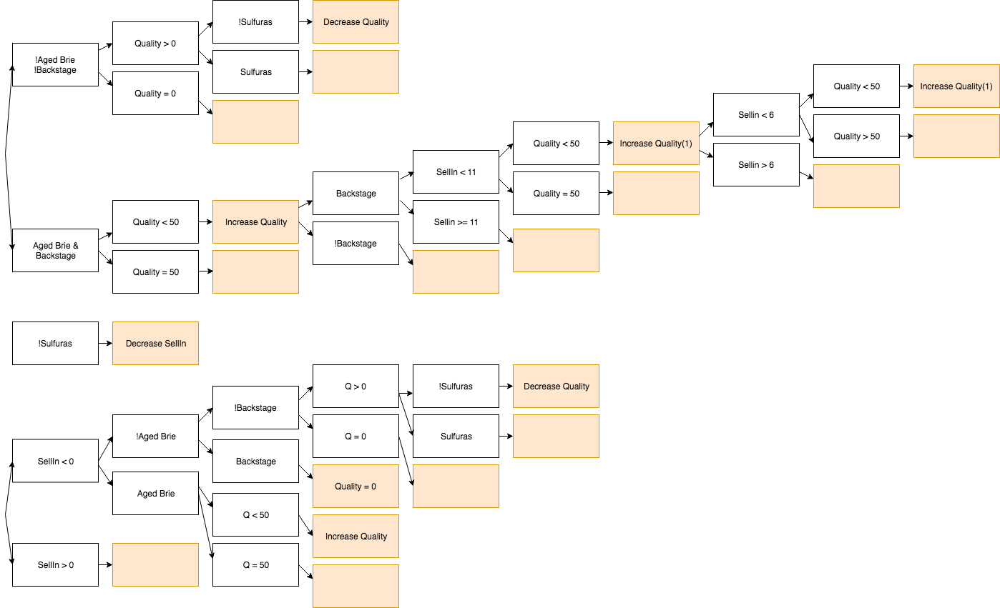
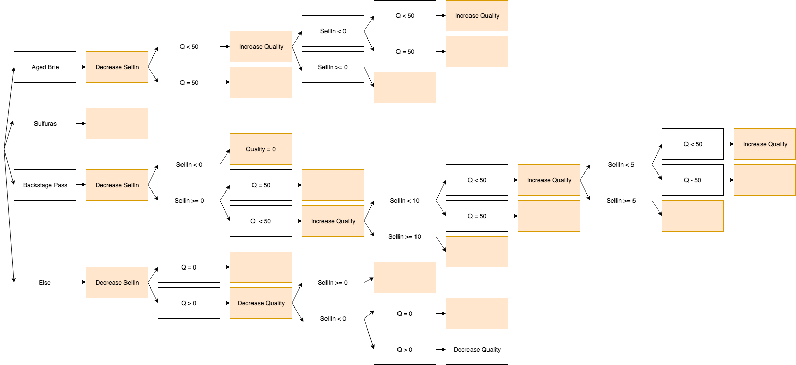

# Gilded Rose Tech Test

## Brief

*"Hi and welcome to team Gilded Rose. As you know, we are a small inn with a prime location in a prominent city run by a friendly innkeeper named Allison. We also buy and sell only the finest goods. Unfortunately, our goods are constantly degrading in quality as they approach their sell by date. We have a system in place that updates our inventory for us. It was developed by a no-nonsense type named Leeroy, who has moved on to new adventures. Your task is to add the new feature to our system so that we can begin selling a new category of items. First an introduction to our system:

All items have a SellIn value which denotes the number of days we have to sell the item. All items have a Quality value which denotes how valuable the item is. At the end of each day our system lowers both values for every item. Pretty simple, right? Well this is where it gets interesting:

Once the sell by date has passed, Quality degrades twice as fast
The Quality of an item is never negative
“Aged Brie” actually increases in Quality the older it gets
The Quality of an item is never more than 50
“Sulfuras”, being a legendary item, never has to be sold or decreases in Quality
“Backstage passes”, like aged brie, increases in Quality as it’s SellIn value approaches; Quality increases by 2 when there are 10 days or less and by 3 when there are 5 days or less but Quality drops to 0 after the concert
We have recently signed a supplier of conjured items. This requires an update to our system:

“Conjured” items degrade in Quality twice as fast as normal items
Feel free to make any changes to the UpdateQuality method and add any new code as long as everything still works correctly. However, do not alter the Item class or Items property as those belong to the goblin in the corner who will insta-rage and one-shot you as he doesn’t believe in shared code ownership (you can make the UpdateQuality method and Items property static if you like, we’ll cover for you)."*

## Approach

I started by mapping out what was going on in the updateQuality function to make sense of it.



Using this diagram I tried to write down every possible scenario and, wrote some tests that all passed with the original code.


I then started looking for repetitive behavior and for every line or block of code that happened more than once, I extracted it into a function that I named describing what it did. I refactored the existing code using those functions to make it read a bit more like English.

After that, I thought the best way to implement a new type of item with a different behavior would be for the updateQuality function to look at the name of the item first and act accordingly. I redesigned the diagram with this in mind.



I then refactored the updateQuality function to follow this pattern, then extracted each case into a new function that would be called inside updateQuality.

Finally, all I had to do to implement the new item was to add an "else if" in my updateQuality method, that would call its own function for amending SellIn and Quality.

## Running Instructions

1. Clone this repository
2. Open SpecRunner.html in the browser, all tests should pass
3. Open the console

You can create a shop with different items as parameters.

Example: ```gildedRose = new Shop([ new Item("Conjured", 0, 2), new Item('Backstage passes to a TAFKAL80ETC concert', 11, 50), new Item("foo", 1, 2)])```

At the end of each day, the innkeeper would update the quality and sell by date of each item like so: ```gildedRose.updateQuality()```
